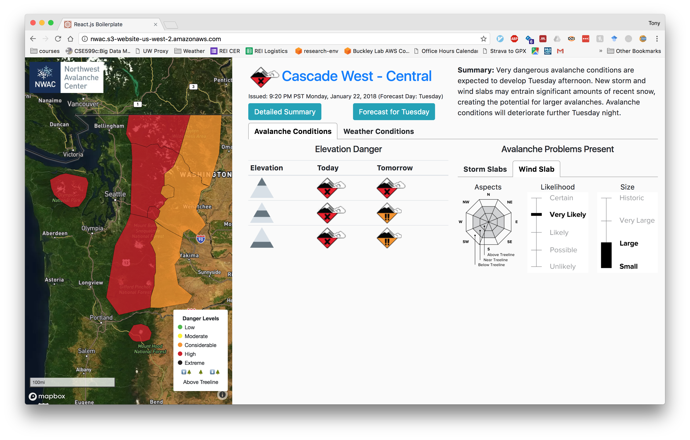

# NWAC v2  
---
[live demo](nwac.s3-website-us-west-2.amazonaws.com)

The purpose of this project is to create another interface to the avalanche forecast and weather data available at the Northwest Avalanche Center's [website](http://www.nwac.us). In my opinion, too much clicking is required to evaluate statewide avalanche hazard.

This repository has two elements: 1) a Python API which gathers and serves avalanche and weather forecast information from NWAC's servers, and 2) a front end for interaction with this information, written in Javascript/React.

The API is implemented in [Flask](http://flask.pocoo.org/), and uses [Zappa](https://github.com/Miserlou/Zappa) to package the code to run on serverless cloud architecture [(AWS Lambda)](https://aws.amazon.com/lambda/). 

The front-facing application is written in React and currently exists as a static site on AWS S3. 

